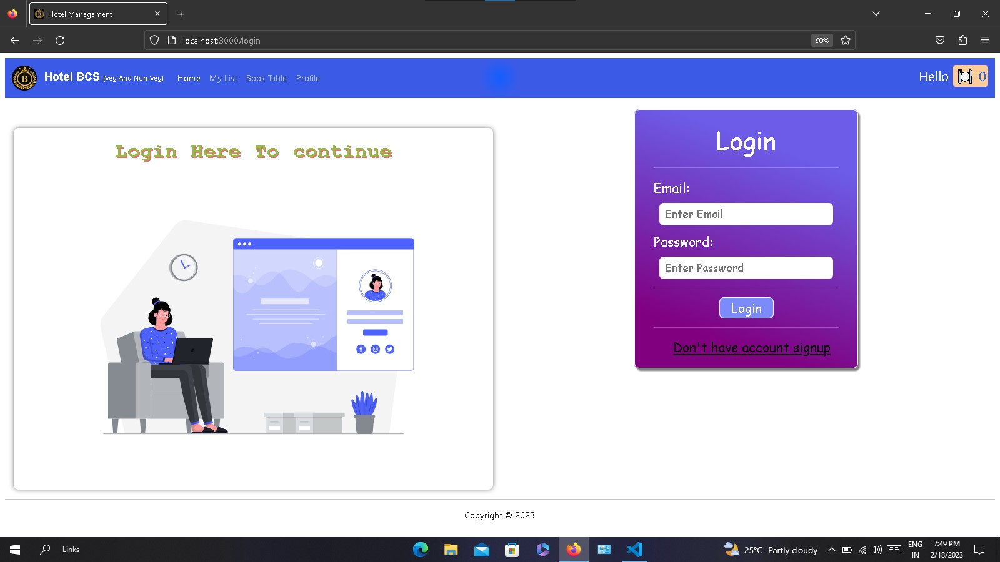
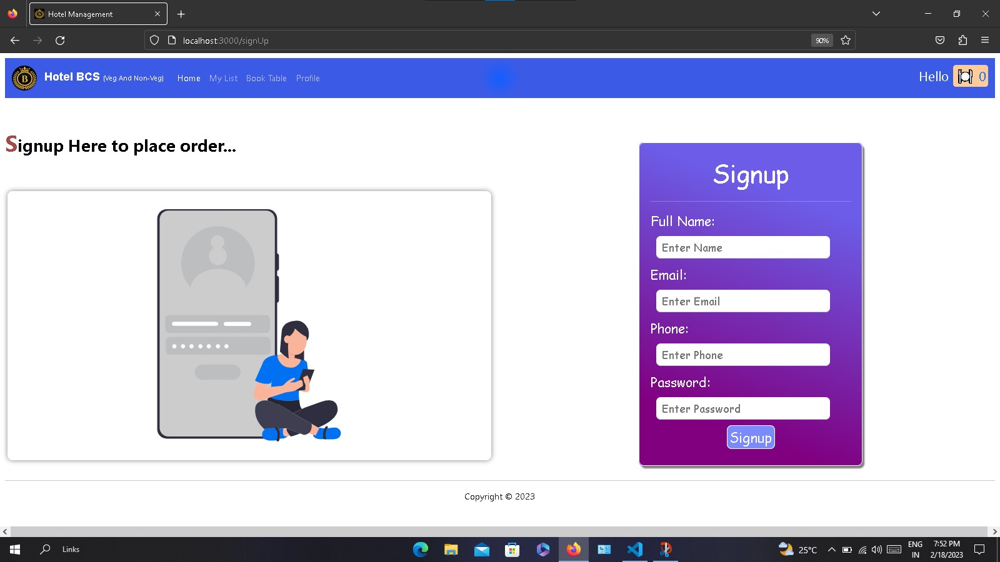
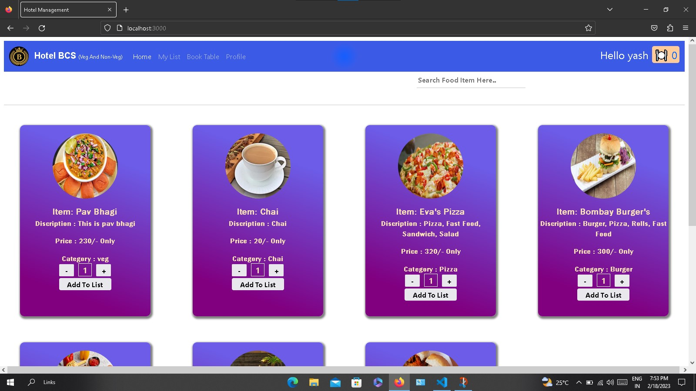
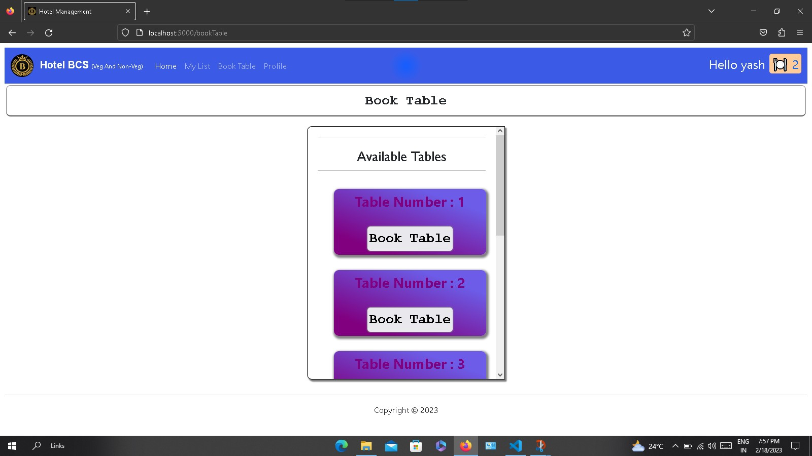
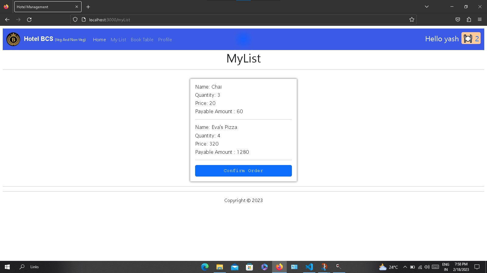
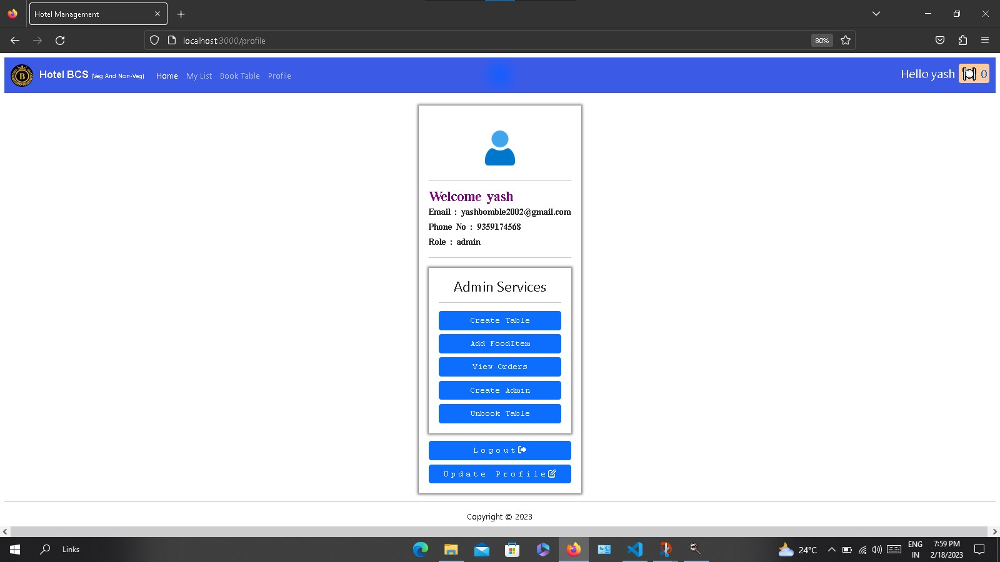
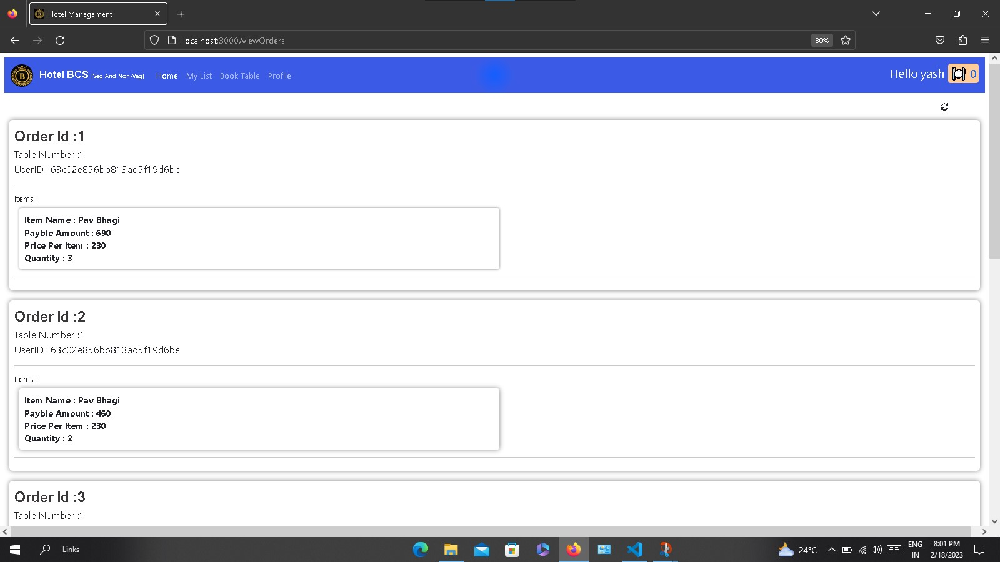

## Hotel_management_project
## Table Bokking System using MERN STAK
### Login Page 👇👇

###
### Signup Page For Normal Users (Other than admin)👇👇
###

### Home page.Where user can order food.👇👇

👇👇

### Table Booking Page For user after selecting order .👇👇

### View List Items page. In this page user can conform their order by clicking Conform Order Button 👇👇

### User Can Also View Their Profile By Using Profile Page. In That Page User Can Also Be Logout Their Account . Their May Be Some Admin Services Which Are Only Visible for Admin Users Only And Those Services Are Available On Profile Page (i.e., Create Table,Add FoodItem , View Orders, Create Admin, Unbook Table). By Using This Page One Admin Can Also Be Create Another Admin. 👇👇

👇👇
#### View Orders (Admin Only)

### Live Project Here
[View Online](https://tablebookingsystem.onrender.com/login)

